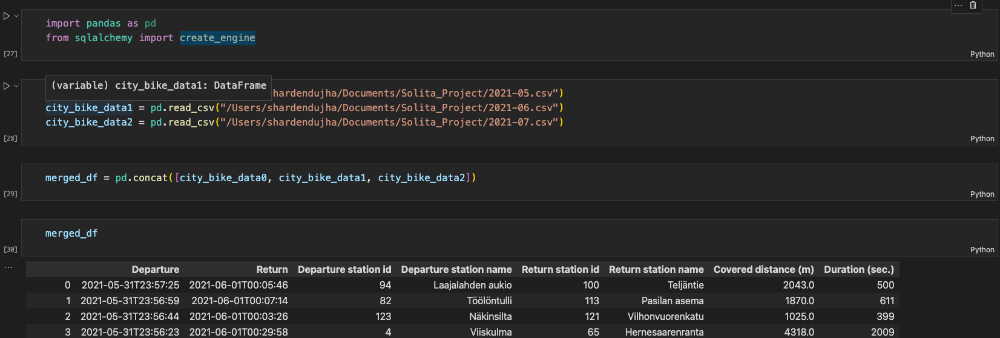
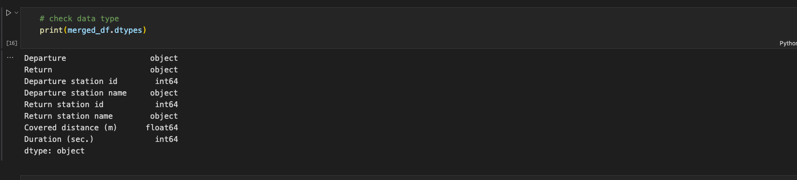
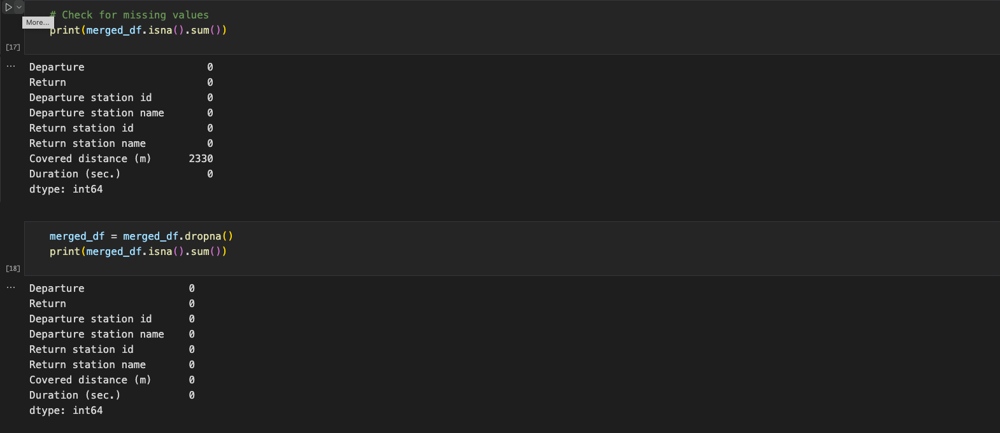
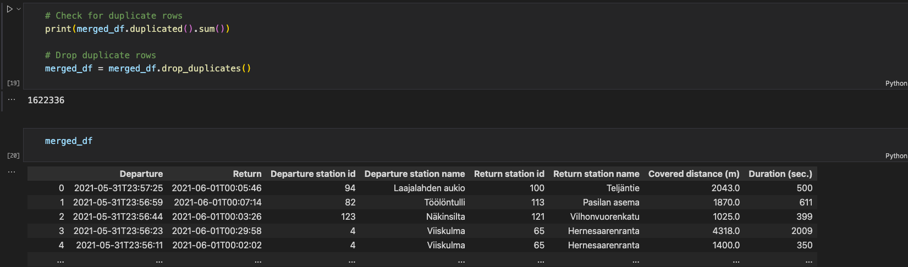
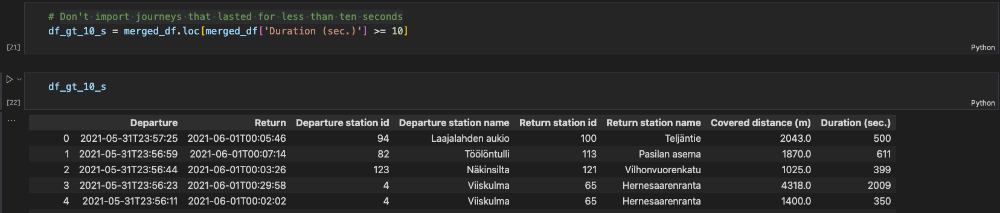
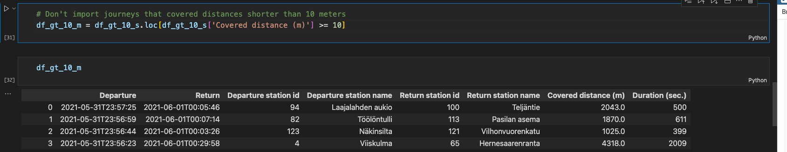
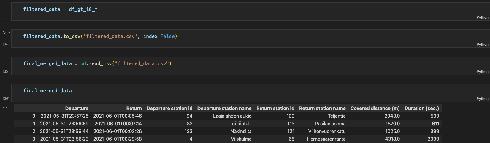
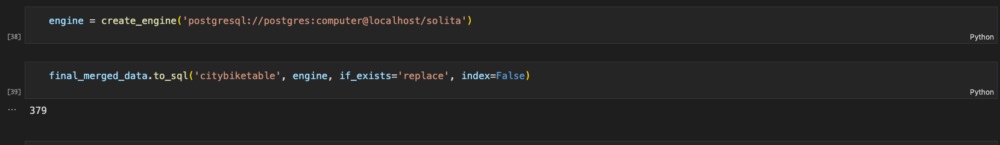
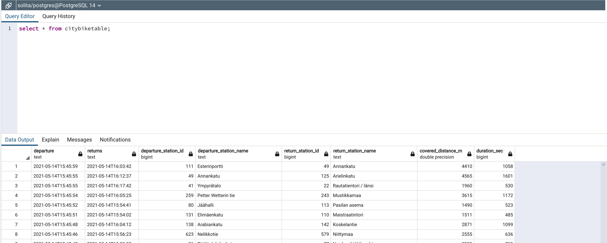

# solita_project

## Helsinki City Bike App(Dev Academy Pre-assignment)

The application is about importing data from given links and storing them in a database. After importing there should be some action done before storing in a database and displaying it in a web based application.

## Technology Used

### Pragramming Language

#### Python

### Framework

#### Flask,Pandas

### Database

#### PostgreSQL

I have used a condo environment to develop a City Bike application instead of virtualenv. The Conda environment is much smoother than virtualenv and supports most of the dependency itself. To be able to run the project there are some required dependencies that should be installed in env and in the system.

#### 1. Install PostgreSQL on Mac( I am using version 10)
#### 2. Install SQLAlchemy
#### 3. Install psycopg2 inside the env
#### 4. Install Flask-bootstrap
#### 5. Flask and rest of the dependency 

#### Data source

https://dev.hsl.fi/citybikes/od-trips-2021/2021-05.csv

https://dev.hsl.fi/citybikes/od-trips-2021/2021-06.csv

https://dev.hsl.fi/citybikes/od-trips-2021/2021-07.csv

#### Data Import

Donloaded data from above links in csv and store it in a local machine. Since there are three different csv files we need to merge them in one csv file.

Validating data before importing merged csv files. There are few steps for validation of any kind of data before use for a specific purpose.

#### Check data type

#### Check for misssing values

#### Check duplicate rows and drop them

#### Don't import journeys that lasted for less than ten seconds

#### Don't import journeys that covered distances shorter than 10 meters

Now the data has been validated so lets save it as a csv file in the local machine.

First connect to postgresql and City Bike data is clean and filtered according to the requirement so lets import into postgresql database.

City Bike data has been imported successfully.

Since sql is case sensitive we need to change column name as sql valid name.

