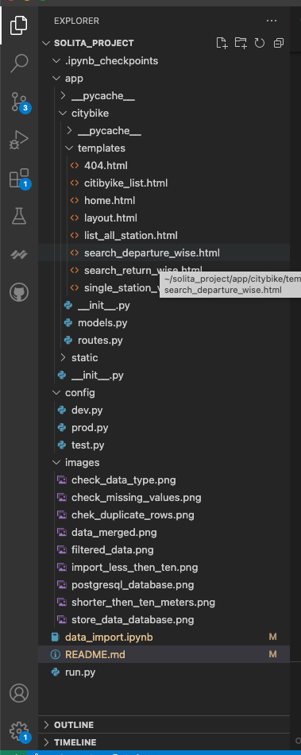
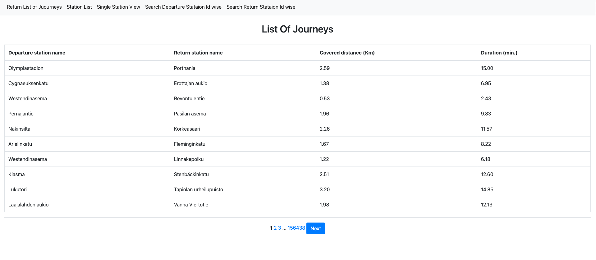
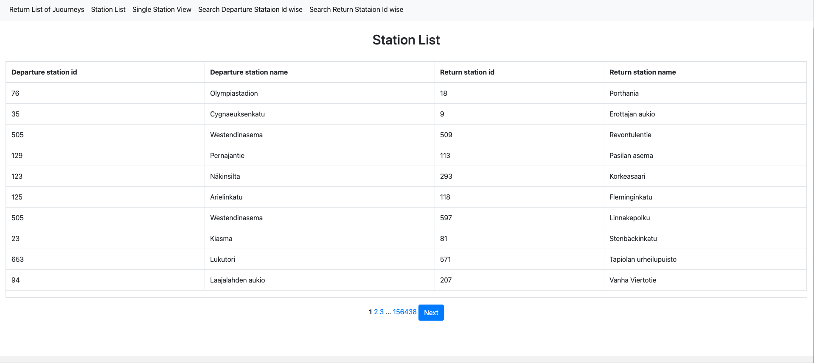
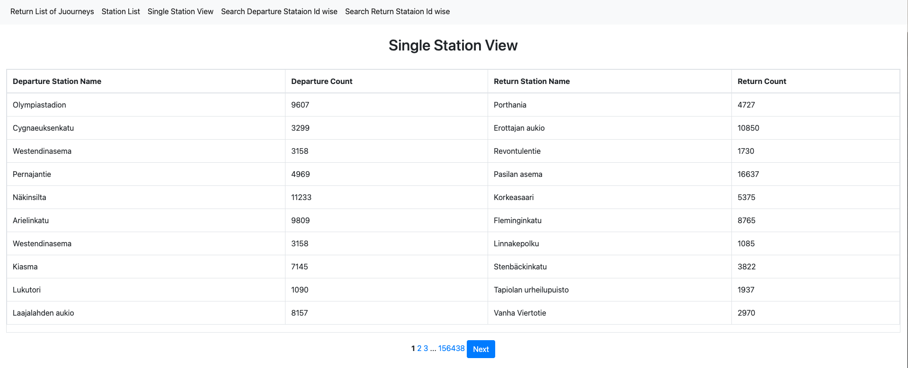
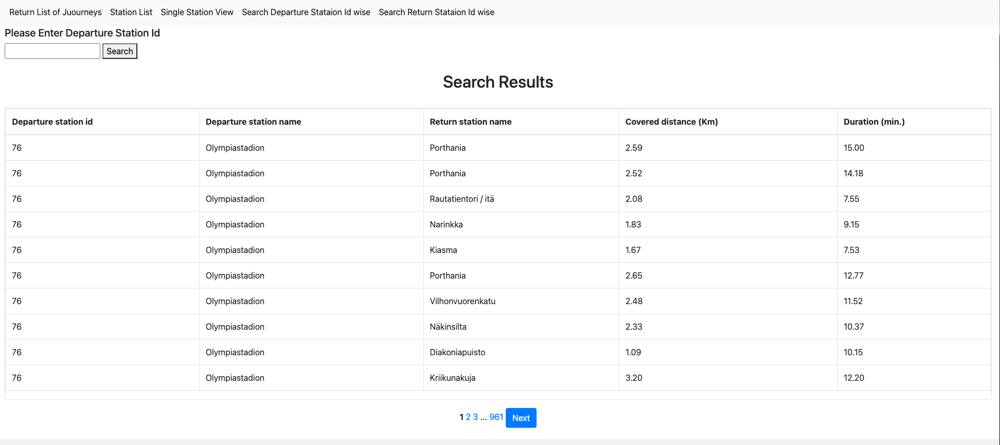
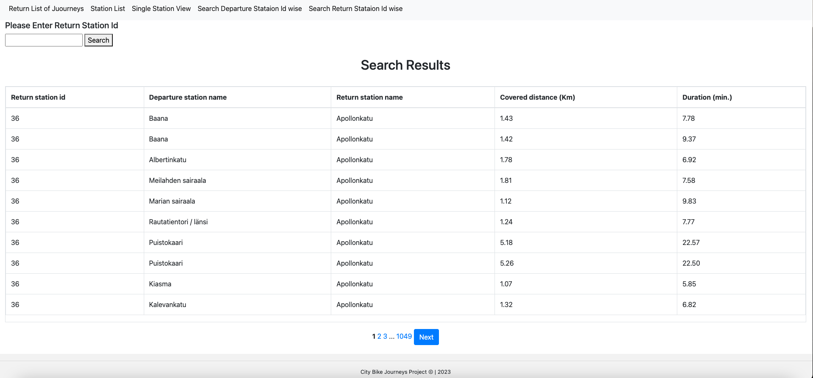

# solita_project

## Helsinki City Bike App(Dev Academy Pre-assignment)

The application is about importing data from given links and storing them in a database. After importing there should be some action done before storing in a database and displaying it in a web based application.

## Technology Used

### Pragramming Language

#### Python

### Framework

#### Flask,Pandas

### Database

#### PostgreSQL

### Code Editor

#### Visual Studio Code

I have used a condo environment to develop a City Bike application instead of virtualenv. The Conda environment is much smoother than virtualenv and supports most of the dependency itself. To be able to run the project there are some required dependencies that should be installed in env and in the system.

#### 1. Install PostgreSQL on Mac( I am using version 10)
#### 2. Install SQLAlchemy
#### 3. Install psycopg2 inside the env
#### 4. Install Flask-bootstrap
#### 5. Flask and rest of the dependency 

#### Data source

https://dev.hsl.fi/citybikes/od-trips-2021/2021-05.csv

https://dev.hsl.fi/citybikes/od-trips-2021/2021-06.csv

https://dev.hsl.fi/citybikes/od-trips-2021/2021-07.csv

#### Data Import

Donloaded data from above links in csv and store it in a local machine. Since there are three different csv files we need to merge them in one csv file.

Validating data before importing merged csv files. There are few steps for validation of any kind of data before use for a specific purpose.

#### Check data type

#### Check for misssing values

#### Check duplicate rows and drop them

#### Don't import journeys that lasted for less than ten seconds

#### Don't import journeys that covered distances shorter than 10 meters

Now the data has been validated so lets save it as a csv file in the local machine.

First connect to postgresql and City Bike data is clean and filtered according to the requirement so lets import into postgresql database.

City Bike data has been imported successfully. Since sql is case sensitive we need to change column name as sql valid name.

Lets move to viewing data on web applications, for this first create a scalable architecture in flask so we can manage our files properly and it also enhances the performances and also dristibuated the load so application runs smoothly.

### Here is the Solita City Bike Project scalable web application architecture.

### Creating Journey list view 

The journey's view, which shows departure and return stations,covered distance in kilometers and  duration in minutes with pagination each page displaying ten rows.

### List of Station

### Single Station View

I don't really understand why the station address is given in the task since the station name and station address are the same so I am including the station name and the number of journeys starting from the station and number of journeys ending at the station.

### Search Departure Station Id Wise

I have added some search options by departure and return id. for example, search with departure with id 76.

### Search Return Station Id Wise

for example, search with return with id 36.

The application has been tested and it's working fine in my system.